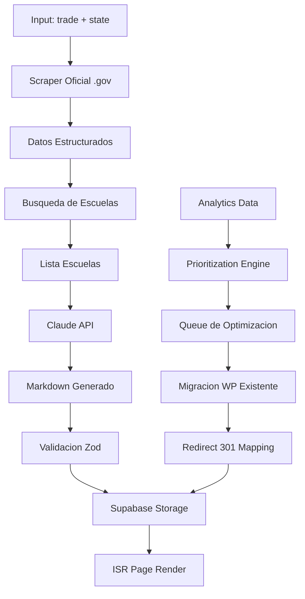

# Plan de Análisis Híbrido de Contenido - ChambaEnUSA v2.0

**Versión:** 1.0  
**Fecha:** 2026-02-05  
**Objetivo:** Migrar contenido WordPress a Next.js + Supabase con optimización IA

---

## 📊 Resumen Ejecutivo

Este plan establece un enfoque híbrido que combina:
- **Análisis de datos existentes** (WordPress XML + Analytics)
- **Generación automatizada con IA** para nuevo contenido
- **Mantenimiento de SEO** mediante preservación de URLs

### Métricas Actuales del Proyecto
| Métrica | Valor | Observación |
|---------|-------|-------------|
| Páginas indexadas | ~90 URLs | Mix de licencias, oficios, estados |
| Impresiones mensuales | 18,923 | Base sólida de visibilidad |
| Clicks mensuales | 197 | CTR promedio 1.04% |
| Posición promedio | 8-10 | Cercana a página 1 |

---

## 🎯 Fases del Plan

### Fase 1: Análisis del Contenido Existente WordPress

#### 1.1 Estructura del Export XML
El export XML contiene:
- **Custom Post Type:** `licencias` (páginas principales)
- **Taxonomías:** `oficio`, `tipo-licencia`, `tematica`
- **Custom Fields:** `pasos`, `preguntas_frecuentes`, `autoridad_reguladora`, `costos_aproximados`, `intro_html`, `cursoeducacion`, `tipos_licencia`, `renovacion`, `link_oficial`

#### 1.2 Script de Análisis del XML
```python
# scripts/analyze_wordpress_xml.py
import xml.etree.ElementTree as ET
from collections import defaultdict
import csv

def analyze_wordpress_export(xml_path):
    """Analiza el export XML de WordPress"""
    tree = ET.parse(xml_path)
    root = tree.getroot()
    
    # Namespaces
    ns = {
        'content': 'http://purl.org/rss/1.0/modules/content/',
        'wp': 'http://wordpress.org/export/1.2/',
        'dc': 'http://purl.org/dc/elements/1.1/'
    }
    
    pages_data = []
    
    for item in root.findall('.//item'):
        post_type = item.find('wp:post_type', ns).text
        if post_type in ['licencias', 'page', 'post']:
            page = {
                'title': item.find('title').text,
                'link': item.find('link').text,
                'slug': item.find('wp:post_name', ns).text,
                'type': post_type,
                'status': item.find('wp:status', ns).text,
                'date': item.find('wp:post_date', ns).text,
                'content': item.find('content:encoded', ns).text or '',
            }
            
            # Extraer custom fields
            for meta in item.findall('.//wp:postmeta', ns):
                key = meta.find('wp:meta_key', ns).text
                value = meta.find('wp:meta_value', ns).text
                page[key] = value
            
            pages_data.append(page)
    
    return pages_data

# Generar estadísticas
def generate_content_stats(pages):
    stats = {
        'total_pages': len(pages),
        'by_type': defaultdict(int),
        'by_trade': defaultdict(int),
        'by_state': defaultdict(int),
        'with_custom_fields': defaultdict(int),
    }
    
    for page in pages:
        stats['by_type'][page['type']] += 1
        
        # Extraer oficio y estado del slug
        slug = page['slug']
        # Parsear slug: licencia-electricista-texas
        
    return stats
```

#### 1.3 Métricas de Rendimiento por Página
Combinar datos del XML con analytics CSV:

| Página | Slug | Impresiones | Clicks | CTR | Posición | Prioridad |
|--------|------|-------------|--------|-----|----------|-----------|
| Licencia Cosmetología Texas | licencia-cosmetologia-texas | 4,793 | 35 | 0.73% | 8.28 | 🔴 Alta |
| Licencia Electricista Arizona | licencia-electricista-arizona | 695 | 18 | 2.59% | 8.61 | 🔴 Alta |
| Licencia Electricista Pennsylvania | licencia-electricista-pennsylvania | 790 | 15 | 1.90% | 9.24 | 🔴 Alta |
| Licencia CDL California | licencia-cdl-california | 2,679 | 14 | 0.52% | 10.46 | 🔴 Alta |
| Licencia Electricista New York | licencia-electricista-new-york | 1,490 | 11 | 0.74% | 9.56 | 🟡 Media |
| Licencia Electricista Texas | licencia-electricista-texas | 1,055 | 9 | 0.85% | 11.8 | 🟡 Media |

---

## 📈 Priorización Basada en Analytics

### 2.1 Algoritmo de Scoring
```python
def calculate_page_priority(analytics_row, content_quality_score):
    """
    Score de 0-100 basado en múltiples factores
    """
    impressions = int(analytics_row['Impresiones'].replace(',', ''))
    clicks = int(analytics_row['Clics'].replace(',', ''))
    ctr = float(analytics_row['CTR'].replace('%', '').replace(',', '.'))
    position = float(analytics_row['Posición'])
    
    # Factores de peso
    score = 0
    score += min(impressions / 100, 30)  # Hasta 30 puntos por impresiones
    score += min(clicks * 2, 20)          # Hasta 20 puntos por clicks
    score += min(ctr * 10, 25)            # Hasta 25 puntos por CTR
    score += max(0, (15 - position)) * 2  # Hasta 30 puntos por posición
    
    return min(score, 100)
```

### 2.2 Clasificación de Prioridades

**🔴 PRIORIDAD ALTA** (Score > 50)
- Pages con >1,000 impresiones Y posición < 10
- Pages con >100 clicks
- Pages con CTR > 2%

**🟡 PRIORIDAD MEDIA** (Score 25-50)
- Pages con 100-1,000 impresiones
- Pages con posición 10-15
- Pages con potencial de mejora claro

**🟢 PRIORIDAD BAJA** (Score < 25)
- Pages con <100 impresiones
- Pages sin tráfico orgánico
- Pages de contenido obsoleto

### 2.3 Matrix de Priorización

```
                    ALTO VOLUMEN    BAJO VOLUMEN
                   (impressions)   (impressions)
ALTA POSICIÓN          MIGRATE        EVALUAR
(< posición 10)       AHORA          OPCIONAL

BAJA POSICIÓN         OPTIMIZAR      DESCARTAR
(> posición 10)       SEO            O CONSOLIDAR
```

---

## 🔧 Mejora de Titles y Meta Descriptions

### 3.1 Templates de Meta Tags Optimizados

```typescript
// lib/seo/templates.ts

interface MetaTemplateData {
  trade: string;      // "electricista"
  state: string;      // "Texas"
  stateCode: string;  // "TX"
  year: number;       // 2026
  keywords?: string[];
}

export const metaTemplates = {
  license: {
    title: (data: MetaTemplateData) => 
      `Licencia de ${capitalize(data.trade)} en ${data.state} ${data.year}: Requisitos Oficiales y Escuelas`,
    
    description: (data: MetaTemplateData) => 
      `Guía completa para obtener la licencia de ${data.trade} en ${data.state}. ` +
      `Requisitos oficiales, costos, proceso paso a paso y escuelas bilingües certificadas.`,
    
    keywords: (data: MetaTemplateData) => [
      `licencia de ${data.trade} en ${data.state}`,
      `certificación ${data.trade} ${data.stateCode}`,
      `como obtener licencia ${data.trade}`,
      `escuelas de ${data.trade} ${data.state}`,
    ]
  },
  
  licenseLevel: {
    title: (data: MetaTemplateData & { level: string }) =>
      `Licencia ${capitalize(data.level)} de ${capitalize(data.trade)} en ${data.state} ${data.year}`,
    
    description: (data: MetaTemplateData & { level: string }) =>
      `Todo sobre la licencia de ${data.level} para ${data.trade} en ${data.state}. ` +
      `Requisitos, examen, costos y renovación.`,
  }
};
```

### 3.2 Optimización Masiva con IA
```python
# scripts/optimize_meta.py
from anthropic import Anthropic
import pandas as pd

SYSTEM_PROMPT = """
Eres un experto SEO especializado en licencias profesionales en EE.UU.
Genera titles y meta descriptions optimizados para hispanohablantes.
"""

def generate_optimized_meta(content: str, keywords: list[str], current_title: str) -> dict:
    """Genera title y description optimizados usando IA"""
    prompt = f"""
    Analiza este contenido y genera un title y description SEO optimizados:
    
    CONTENIDO ACTUAL:
    Title: {current_title}
    
    Content excerpt: {content[:2000]}
    
    Keywords objetivo: {', '.join(keywords)}
    
    Genera en formato JSON:
    {{
        "title": "Title optimizado (60-65 caracteres)",
        "description": "Meta description optimizada (150-160 caracteres)",
        "keywords_suggested": ["kw1", "kw2", "kw3"]
    }}
    """
    
    response = anthropic.messages.create(
        model="claude-sonnet-4-20250514",
        max_tokens=500,
        system=SYSTEM_PROMPT,
        messages=[{"role": "user", "content": prompt}]
    )
    
    return parse_json_response(response)
```

---

## 🤖 Pipeline de Generación de Contenido con IA

### 4.1 Arquitectura del Pipeline



### 4.2 Script de Generación de Contenido
```python
# scripts/generate_content.py
import asyncio
from anthropic import Anthropic
from supabase import create_client, Client
import structlog
from pydantic import BaseModel

logger = structlog.get_logger()

class LicenseContent(BaseModel):
    trade: str
    state: str
    requirements: dict
    schools: list[dict]
    faqs: list[dict]

async def generate_license_page(trade: str, state: str) -> LicenseContent:
    """Genera contenido completo para una página de licencia"""
    
    # 1. Scrape datos oficiales
    requirements = await scrape_official_requirements(trade, state)
    
    # 2. Busca escuelas bilingües
    schools = await search_bilingual_schools(trade, state)
    
    # 3. Genera contenido con Claude
    content_prompt = f"""
    Genera contenido Markdown para la página de licencia de {trade} en {state}.
    
    DATOS OFICIALES:
    {requirements}
    
    ESCUELAS ENCONTRADAS:
    {schools}
    
    Estructura requerida:
    ## Introducción (contexto para hispanohablantes)
    ## Requisitos Oficiales
    ## Proceso Paso a Paso
    ## Escuelas con Programas en Español
    ## Preguntas Frecuentes
    ## Fuentes Oficiales
    ## ¿Necesitas Ayuda?
    
    SEO: Incluir naturalmente keywords relacionadas con el oficio y estado.
    """
    
    client = Anthropic()
    response = client.messages.create(
        model="claude-sonnet-4-20250514",
        max_tokens=4000,
        messages=[{"role": "user", "content": content_prompt}]
    )
    
    # 4. Parse y valida
    content = LicenseContent(
        trade=trade,
        state=state,
        requirements=requirements,
        schools=schools,
        faqs=generate_faqs(trade, state)
    )
    
    return content

async def save_to_supabase(content: LicenseContent, original_slug: str = None):
    """Guarda el contenido generado en Supabase"""
    supabase: Client = create_client(
        os.getenv("SUPABASE_URL"),
        os.getenv("SUPABASE_SERVICE_KEY")
    )
    
    data = {
        "slug": f"licencia-{content.trade}-{content.state.lower()}",
        "trade_id": await get_or_create_trade(content.trade),
        "state_id": await get_or_create_state(content.state),
        "meta_title": generate_meta_title(content),
        "meta_description": generate_meta_description(content),
        "content_md": content.markdown,
        "original_wp_slug": original_slug,  # Para redirects
        "is_published": True,
        "last_updated": datetime.now().isoformat(),
    }
    
    result = supabase.table("license_pages").upsert(data).execute()
    logger.info("Content saved", slug=data["slug"], id=result.data[0]["id"])
    
    return result
```

### 4.3 Configuration de Claude API
```python
# lib/ai/config.py
from anthropic import Anthropic
from dataclasses import dataclass

@dataclass
class ClaudeConfig:
    model: str = "claude-sonnet-4-20250514"
    max_tokens: int = 4000
    temperature: float = 0.7
    system_prompt: str = """
    Eres un experto en licencias y certificaciones profesionales en EE.UU.
    Escribes para hispanohablantes que viven en Estados Unidos.
    
    Tu estilo:
    - Profesional pero accesible
    - Claro y directo
    - Sin jerga innecesaria
    - Contexto cultural estadounidense
    
    Formato:
    - Markdown bien estructurado
    - Listas cuando aportan claridad
    - Headers jerárquicos (H2, H3)
    - Énfasis en información práctica
    """

def get_claude_client() -> Anthropic:
    return Anthropic(api_key=os.getenv("ANTHROPIC_API_KEY"))

# Prompt optimizado para licencias
LICENSE_PAGE_PROMPT = """
Genera el contenido para la página de licencia de {trade} en {state}.

Contexto del proyecto: ChambaEnUSA es el portal #1 en español para hispanos en EE.UU. que buscan certificarse en oficios.

Instrucciones:
1. **Introducción**: 2-3 párrafos que conecten con la audiencia hispana, mencionando oportunidades laborales y por qué es importante esta licencia.
2. **Requisitos Oficiales**: Lista clara con edad, horas requeridas, documentos, costos.
3. **Proceso Paso a Paso**: 5-7 pasos numerados.
4. **Escuelas**: Menciona escuelas encontradas con programas en español.
5. **FAQs**: 5-7 preguntas basadas en búsquedas reales de hispanohablantes.
6. **Fuentes**: Cita URLs oficiales .gov.
7. **CTA**: Invita al usuario a填写 formulario para más información.

Longitud: 1500-2500 palabras.
Keywords的自然mente: {keywords}
"""
```

---

## 📦 Script de Migración Automatizada

### 5.1 Pipeline Completo de Migración
```python
# scripts/migrate_wordpress.py
#!/usr/bin/env python3
"""
Migrate WordPress content to Next.js + Supabase
Preserves URLs for SEO with 301 redirects
"""

import asyncio
import xml.etree.ElementTree as ET
from pathlib import Path
from typing import Dict, List, Optional
import structlog
from slugify import slugify

logger = structlog.get_logger()

class WordPressMigrator:
    def __init__(self, xml_path: str, supabase_url: str, supabase_key: str):
        self.xml_path = xml_path
        self.supabase_url = supabase_url
        self.supabase_key = supabase_key
        self.redirect_map: Dict[str, str] = {}
        
    async def run_migration(self):
        """Ejecuta la migración completa"""
        logger.info("Starting WordPress migration")
        
        # 1. Parse XML
        pages = await self.parse_wordpress_xml()
        logger.info(f"Found {len(pages)} pages to migrate")
        
        # 2. Analyze and prioritize
        prioritized = self.prioritize_pages(pages)
        
        # 3. Transform content
        transformed = []
        for page in prioritized:
            transformed_page = await self.transform_page(page)
            transformed.append(transformed_page)
            self.redirect_map[page['slug']] = transformed_page['slug']
            
        # 4. Import to Supabase
        await self.import_to_supabase(transformed)
        
        # 5. Generate redirect map
        self.generate_redirect_file()
        
        logger.info("Migration complete", migrated=len(transformed))
        
    async def parse_wordpress_xml(self) -> List[Dict]:
        """Parse WordPress export XML"""
        tree = ET.parse(self.xml_path)
        root = tree.getroot()
        
        ns = {'wp': 'http://wordpress.org/export/1.2/'}
        pages = []
        
        for item in root.findall('.//item'):
            post_type = item.find('wp:post_type', ns)
            if post_type is None:
                continue
                
            page = {
                'title': item.find('title').text or '',
                'link': item.find('link').text or '',
                'slug': item.find('wp:post_name', ns).text or '',
                'type': post_type.text,
                'status': item.find('wp:status', ns).text or 'draft',
                'content': self.extract_content(item),
                'custom_fields': self.extract_custom_fields(item),
                'categories': self.extract_categories(item),
            }
            
            # Solo migrar contenido público
            if page['status'] == 'publish':
                pages.append(page)
                
        return pages
    
    def extract_content(self, item) -> Dict[str, str]:
        """Extract main content and custom fields"""
        content = {}
        
        # Main content
        content_encoded = item.find('content:encoded')
        if content_encoded is not None:
            content['body'] = content_encoded.text or ''
            
        # Custom fields
        for meta in item.findall('.//wp:postmeta'):
            key = meta.find('wp:meta_key')
            value = meta.find('wp:meta_value')
            if key is not None and value is not None:
                content[key.text] = value.text or ''
                
        return content
    
    def extract_categories(self, item) -> Dict[str, str]:
        """Extract WordPress categories/taxonomies"""
        categories = {'oficio': None, 'estado': None, 'tipo_licencia': []}
        
        for cat in item.findall('category'):
            domain = cat.get('domain', '')
            nicename = cat.get('nicename', '')
            
            if domain == 'oficio':
                categories['oficio'] = cat.text
            elif domain == 'tipo-licencia':
                categories['tipo_licencia'].append(cat.text)
            elif domain == 'tematica':
                if 'estado' in nicename:
                    categories['estado'] = cat.text
                    
        return categories
    
    def prioritize_pages(self, pages: List[Dict]) -> List[Dict]:
        """Prioritize pages based on SEO potential"""
        # Load analytics data
        analytics_data = self.load_analytics_data()
        
        for page in pages:
            page['priority'] = self.calculate_priority(page, analytics_data)
            
        return sorted(pages, key=lambda x: x['priority'], reverse=True)
    
    def calculate_priority(self, page: Dict, analytics: Dict) -> int:
        """Calculate migration priority score"""
        slug = page['slug']
        
        if slug in analytics:
            row = analytics[slug]
            impressions = row.get('impressions', 0)
            clicks = row.get('clicks', 0)
            position = row.get('position', 50)
            
            # Score calculation
            score = min(impressions / 50, 30)
            score += min(clicks * 2, 30)
            score += max(0, (15 - position))
            
            return int(score)
            
        return 10  # Default priority
    
    async def transform_page(self, page: Dict) -> Dict:
        """Transform WordPress page to Next.js format"""
        
        # Extract trade and state from slug or categories
        slug = page['slug']
        categories = page['categories']
        
        trade = categories['oficio'] or extract_trade_from_slug(slug)
        state = categories['estado'] or extract_state_from_slug(slug)
        
        # Transform content
        body_html = page['content'].get('body', '')
        body_markdown = self.html_to_markdown(body_html)
        
        # Build structured content
        transformed = {
            'slug': f"licencia-{slugify(trade)}-{slugify(state)}",
            'original_wp_slug': slug,
            'title': page['title'],
            'meta_title': self.generate_meta_title(trade, state),
            'meta_description': self.generate_meta_description(trade, state),
            'content_md': self.build_markdown_content(page['content'], trade, state),
            'trade': trade,
            'state': state,
            'requirements': self.extract_requirements(page['content']),
            'faqs': self.extract_faqs(page['content']),
            'source_url': page['content'].get('link_oficial', ''),
            'is_published': True,
        }
        
        return transformed
    
    def build_markdown_content(self, content: Dict, trade: str, state: str) -> str:
        """Build complete Markdown content"""
        
        parts = []
        
        # Introduction
        intro = content.get('intro_html', '')
        if intro:
            parts.append("## Introducción\n\n")
            parts.append(self.html_to_markdown(intro))
            
        # Requirements table
        parts.append("\n## Requisitos Oficiales\n\n")
        parts.append(self.build_requirements_table(content))
        
        # Steps
        pasos = content.get('pasos', '')
        if pasos:
            parts.append("\n## Proceso Paso a Paso\n\n")
            parts.append(self.html_to_markdown(pasos))
            
        # Exam info
        examen = content.get('examen', '')
        if examen:
            parts.append("\n## Acerca del Examen\n\n")
            parts.append(self.html_to_markdown(examen))
            
        # Schools/Courses
        cursos = content.get('cursoeducacion', '')
        if cursos:
            parts.append("\n## Escuelas y Programas de Formación\n\n")
            parts.append(self.html_to_markdown(cursos))
            
        # Types of licenses
        tipos = content.get('tipos_licencia', '')
        if tipos:
            parts.append("\n## Tipos de Licencias Disponibles\n\n")
            parts.append(self.html_to_markdown(tipos))
            
        # FAQs
        faqs = content.get('preguntas_frecuentes', '')
        if faqs:
            parts.append("\n## Preguntas Frecuentes\n\n")
            parts.append(self.html_to_markdown(faqs))
            
        # Footer with source
        link_oficial = content.get('link_oficial', '')
        if link_oficial:
            parts.append(f"\n## Fuentes Oficiales\n\n")
            parts.append(f"- [Información oficial del TDLR]({link_oficial})\n")
            
        return ''.join(parts)
    
    def generate_redirect_file(self):
        """Generate Next.js redirect configuration"""
        
        redirects = []
        
        for old_slug, new_slug in self.redirect_map.items():
            if old_slug != new_slug:
                redirects.append({
                    "source": f"/{old_slug}/",
                    "destination": f"/{new_slug}/",
                    "permanent": True
                })
                
        # Save redirects config
        with open('app/redirects.json', 'w') as f:
            json.dump(redirects, f, indent=2)
            
        # Generate _redirects file for Netlify
        with open('public/_redirects', 'w') as f:
            for old_slug, new_slug in self.redirect_map.items():
                if old_slug != new_slug:
                    f.write(f"/{old_slug}/ /{new_slug}/ 301!\n")
                    
        logger.info("Redirect files generated", count=len(redirects))
```

### 5.2 Configuración de Redirects para Next.js
```typescript
// app/[[...slug]]/redirects.ts
import { NextResponse } from 'next/server'

// Mapeo de URLs antiguas a nuevas (generado por script de migración)
const redirects: Record<string, string> = {
  '/licencia-electricista-texas/': '/licencia-electricista-texas/',
  // ... más redirects
}

export async function redirects() {
  const { nextUrl } = request
  
  if (redirects[nextUrl.pathname]) {
    return NextResponse.redirect(redirects[nextUrl.pathname], 301)
  }
  
  return NextResponse.next()
}

// O usar next.config.js
const redirects = async () => [
  {
    source: '/old-slug/:path*',
    destination: '/new-slug/:path*',
    permanent: true,
  },
]
```

---

## 📋 Checklist de Implementación

### Análisis Inicial
- [ ] Ejecutar script de análisis del XML
- [ ] Validar estructura de custom fields
- [ ] Cruzar datos con analytics CSV
- [ ] Generar matrix de priorización

### Mejora de SEO
- [ ] Implementar templates de meta tags
- [ ] Generar titles/descriptions optimizados
- [ ] Crear schema.org structured data
- [ ] Configurar canonical URLs

### Pipeline IA
- [ ] Configurar Claude API
- [ ] Crear scraper de fuentes oficiales
- [ ] Implementar validación Zod
- [ ] Conectar con Supabase

### Migración
- [ ] Ejecutar script de migración
- [ ] Validar redirects 301
- [ ] Probar URLs migradas
- [ ] Verificar indexación en GSC

### Post-Migración
- [ ] Monitorizar rankings
- [ ] Ajustar según performance
- [ ] Documentar cambios
- [ ] Backup de datos migrados

---

## 📊 Métricas de Éxito

| Métrica | Actual | Objetivo (3 meses) |
|---------|--------|-------------------|
| CTR promedio | 1.04% | 3% |
| Posición promedio | 8-10 | 3-5 |
| Páginas indexadas | 90 | 200+ |
| Tráfico mensual | 18K impresiones | 50K impresiones |
| Leads capturados | - | 300/mes |

---

## 🗂️ Archivos de Salida

El script de migración generará:
1. `migracion/pages_migrated.json` - Datos de páginas migradas
2. `migracion/redirects.json` - Mapeo de redirects 301
3. `migracion/metadata_optimized.json` - Titles/descriptions optimizados
4. `migracion/logs/migration.log` - Logs de ejecución

---

**Próximo Paso:** Ejecutar análisis inicial con script `analyze_wordpress_xml.py` para validar estructura de datos.
